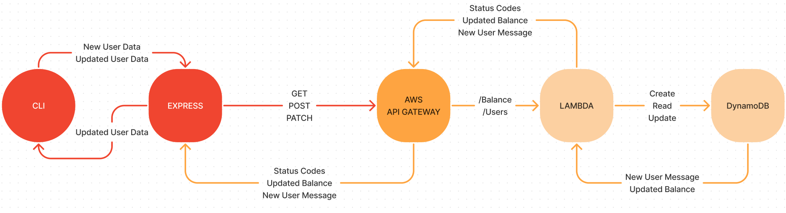

# Terminal Casino Backend

## Summary

A solo player text based casino app that encourages the user to have healthier gambling
habits. The user will earn `bits` by solving math equations and use those `bits`
to play casino games.

### Requirements

For development, you will only need [Node](http://nodejs.org/) installed in your
environment.
Please use the appropriate [Editorconfig](http://editorconfig.org/) plugin for
your Editor (not mandatory).

### Install

    git clone https://github.com/T-Casino-Inc/terminal-casino-backend.git
    cd terminal-casino-backend
    npm install

### Configure app

Create `.env` file in the root directory and add the following:

**Note:** You will need to get the `JWKS_URI` from your Auth0 account.

```env
PORT = 3001
JWKS_URI=FROM_AUTH0
```

### Start & watch

    npm run dev
    npm start

## Architecture

### UML Diagram



### User Model


### Languages & tools

- JavaScript
- Node.js
- Express
- Axios
- Dotenv
- Cors
- Supertest
- jsonwebtoken
- jwks-rsa
- nodemon
- Jest
- SuperTest

## Change Log

1.0.0 - Initial release

## Contributors

- Brock Britton
- Justin Cheeseman
- Isai Chaidez
